# Chapter 3: Following the Money - A Transaction's Journey

**Understanding blockchain investment requires understanding what actually happens when value moves.** Not the theory. The mechanics.

This chapter follows a single transaction from Alice sending 1 ETH to Bob—from the moment she clicks "send" to the moment it's permanent. Every step reveals a technology component. Every component represents either a strength or a vulnerability you're betting on.

## Transaction Journey Overview


---

## Step 1: Transaction Creation (The Wallet Layer)

**What happens:** Alice opens her wallet app and initiates: "Send 1 ETH to Bob."

### Technology: Public Key Cryptography

Her wallet contains two keys:
- **Private key**: A 256-bit random number. Never leaves her device. Think of it as a password that can't be reset.
- **Public key**: Mathematically derived from the private key. Generates her address (0x742d...).

**The critical property:** You can derive a public key from a private key, but you cannot reverse it. This one-way function (elliptic curve cryptography) is what makes self-custody possible.

**Why investors care:**
- No bank intermediary needed = reduced counterparty risk
- No password reset = if you lose keys, funds are gone forever
- Same cryptography protecting trillions in traditional finance (TLS, SSH)

The transaction Alice creates contains:
- **To**: Bob's address (0x8f3a...)
- **Value**: 1 ETH
- **Gas limit**: Maximum computation she'll pay for (21,000 units)
- **Gas price**: Her bid per unit (50 gwei)
- **Nonce**: Transaction counter from her account (prevents replay attacks)

---

## Step 2: Transaction Signing (Cryptographic Proof)

**What happens:** Her wallet signs the transaction with her private key.

### Technology: Digital Signatures (ECDSA)

The signing algorithm creates a unique signature that proves:
1. This transaction was authorized by the holder of the private key
2. The transaction data hasn't been altered
3. The signature is unique to this specific transaction

**The math:** The signature is created using the transaction data plus Alice's private key. Anyone can verify it using Alice's public key, but only Alice's private key could have created it.

**Why investors care:**
- This is how blockchain achieves "trustless" transactions
- No middleman verifies identity—the math does it
- Signatures can't be forged (would require breaking 256-bit encryption)
- Once signed, transaction is immutable

**Security model:** Breaking ECDSA would require computing ~2^128 operations. For context, Bitcoin's entire network performs ~2^92 operations per year. It's computationally infeasible.

---

## Step 3: Broadcasting (Peer-to-Peer Network)

**What happens:** Alice's wallet broadcasts the signed transaction to connected nodes.

### Technology: Network Propagation (Varies by Blockchain)

Most blockchains are peer-to-peer—no central servers. But how transactions spread differs significantly:


#### **Gossip Protocol (Bitcoin, Ethereum, Cardano)**

**Classic decentralized approach:**

Nodes connect to 10-50 random peers across the globe.

**The propagation:**
1. Alice's wallet sends to 8 connected nodes
2. Each node validates and forwards to its peers
3. Transaction spreads exponentially (like gossip spreading through a crowd)
4. Within 1-3 seconds, thousands of nodes have it

**Validation checks nodes perform:**
- Signature is cryptographically valid
- Alice's account has ≥1 ETH
- Nonce is correct (next in sequence)
- Gas price meets minimum threshold
- Transaction format is correct

**Pros:**
- Highly decentralized (no coordinator)
- Censorship resistant (no single chokepoint)
- Resilient (nodes can drop out)

**Cons:**
- Slower (redundant forwarding)
- Bandwidth inefficient (same data sent many times)
- Hard to optimize for speed

**Network topology matters:** Bitcoin has ~15,000 active nodes. Ethereum has ~8,000. Smaller networks with <1,000 nodes are easier to attack or censor.

#### **Turbine Block Propagation (Solana)**

**Optimized for speed:**

Instead of gossip, Solana uses **Turbine** - a block propagation protocol inspired by BitTorrent.

**How it works:**
1. Leader node breaks blocks into small packets using erasure coding
2. Packets stream to validators in a tree structure (not random gossip)
3. Each validator receives different packets and forwards to specific downstream peers
4. Validators can reconstruct the full block from partial data (erasure coding magic)

**Result:** Block propagation in ~200-400ms vs 1-3 seconds for gossip.

**Trade-off:**
- Much faster (enables 400ms blocks)
- But requires high-performance validators (~10 Gbps networking)
- More structured = slightly more centralized topology

#### **Sequencer Model (Arbitrum, Optimism, Base - Layer 2s)**

**Centralized transaction ordering, decentralized settlement:**

**How it works:**
1. Alice sends transaction to a single **Sequencer** (not thousands of nodes)
2. Sequencer immediately orders and executes transactions
3. Sequencer batches transactions and posts to Ethereum L1 for finality

**Why this model:**
- Instant pre-confirmations (10-50ms)
- No mempool MEV (sequencer controls ordering)
- Cheaper (less redundant data transmission)

**Trade-off:**
- Centralized sequencer = single point of failure/censorship
- Most L2s plan to decentralize sequencers (not yet implemented)

---

### Why Investors Care About Network Architecture

**1. Decentralization vs Performance Trade-off**
- Gossip (Bitcoin/Ethereum): Slow but maximally decentralized
- Turbine (Solana): Fast but requires expensive validators
- Sequencer (L2s): Fastest but centralized (for now)

**Investment question:** What level of decentralization does the use case require?

**2. Censorship Resistance**
- Gossip networks: Very hard to censor (must block thousands of random nodes)
- Sequencer L2s: Easy to censor (pressure one entity)
- Geographic diversity matters: If 80% of nodes in one jurisdiction, censorship becomes easier

**Investment question:** How resistant is this network to government pressure?

**3. Single Points of Failure**
- Gossip: Resilient (no coordinators)
- Sequencer: Vulnerable (if sequencer goes down, network halts)
  - Recent example: Base sequencer issues (Dec 2023) paused the network briefly

**Investment question:** What happens if key infrastructure fails?

### Network Architecture Summary

| Blockchain | Propagation Model | Speed | Decentralization | Trade-off |
|------------|------------------|-------|------------------|-----------|
| **Bitcoin** | Gossip | 1-3 sec | ⭐⭐⭐⭐⭐ (15K nodes) | Slow but maximally decentralized |
| **Ethereum** | Gossip | 1-3 sec | ⭐⭐⭐⭐ (8K nodes) | Slower but decentralized |
| **Solana** | Turbine (erasure coding) | 200-400ms | ⭐⭐⭐ (~1,800 validators) | Fast but requires powerful hardware |
| **Arbitrum/Optimism** | Centralized Sequencer | 10-50ms | ⭐ (1 sequencer) | Instant but centralized risk |
| **Avalanche** | Gossip + Repeated Voting | ~1 sec | ⭐⭐⭐⭐ (~1,800 validators) | Fast consensus through aggressive networking |

---

## Step 4: The Mempool (Transaction Marketplace)

**What happens:** The transaction sits in every node's mempool (memory pool) waiting to be included in a block.

### Technology: Transaction Ordering & Priority

The mempool is not first-come-first-served. It's a **fee market**.

**Transactions compete on:**
- **Gas price**: Higher bidders get priority
- **Transaction type**: Some are time-sensitive (MEV opportunities)
- **Network congestion**: During peak usage, low bids get stuck

**Current state (Ethereum example):**
- Mempool typically contains 100,000-300,000 pending transactions
- Gas prices range from 5 gwei (slow) to 500+ gwei (urgent) depending on demand
- Average inclusion time: 12-30 seconds for standard transactions
- During NFT mints or market crashes: gas can spike to 1,000+ gwei

**Why investors care:**
- Transaction costs fluctuate wildly based on demand
- This creates economic constraints on blockchain use (high fees killed some use cases)
- Layer 2 solutions emerged specifically to address this (see Chapter 2)
- Fee revenue accrues to validators/miners = key economic sustainability metric

---

### Understanding MEV: The Hidden Tax

**MEV (Maximal Extractable Value)** is profit that validators/miners can extract by manipulating transaction ordering. Think of it as an invisible tax on users.


**How it works - Concrete Example:**

Say you submit a trade on Uniswap: Buy 100 ETH at current price $2,500.

A searcher (MEV bot) sees your transaction in the mempool:
1. **Front-run:** Bot buys 100 ETH before your transaction (pushing price to $2,520)
2. **Your transaction executes:** You buy at the higher price $2,520
3. **Back-run:** Bot immediately sells 100 ETH at $2,520, pocketing the difference

**You just paid an extra $20 per ETH = $2,000 invisible tax.** This is called a "sandwich attack."

**Other MEV strategies:**
- **Liquidations:** Bots race to liquidate undercollateralized DeFi positions (earn liquidation bonuses)
- **Arbitrage:** Exploiting price differences between DEXs
- **NFT sniping:** Front-running popular NFT mints

**The scale:**
- Ethereum: $500M-1B+ extracted annually
- Individual sandwich attacks: Often $100-10,000 per victim
- Large liquidations: $50K-500K per event

**Why it exists:**
Anyone who can see pending transactions (public mempool) AND control ordering (validators/miners) can extract value. It's structurally embedded in how blockchains work.

**Does every blockchain have MEV?**

| Blockchain | MEV Risk | Why |
|------------|----------|-----|
| **Ethereum** | ⚠️ Very High | Public mempool + DeFi activity = massive MEV |
| **Bitcoin** | ✅ Low | Simple transfers, no DeFi, no complex arbitrage |
| **Solana** | ⚠️ Moderate | Fast blocks limit front-running window, but exists |
| **Arbitrum/Optimism (L2s)** | ⚠️ High | Inherit Ethereum's MEV + sequencer centralization |
| **Flashbots/Private Mempools** | ✅ Reduced | Users can bypass public mempool |

**Mitigation Tools for Investors:**

1. **Use Private RPCs/Relays:**
   - **Flashbots Protect RPC**: Send transactions directly to validators, skip public mempool
   - **Rated RPC**: Private transaction routing
   - **Eden Network**: Pre-trade privacy
   
   **How:** Change your wallet's RPC endpoint from public to private

2. **MEV Protection Built Into Apps:**
   - **CoW Swap**: Batches trades, extracts MEV for users instead
   - **1inch Fusion**: Off-chain order matching, no front-running
   - **UniswapX**: Private order flow with Dutch auctions
   
   **Check if your DEX offers MEV protection before trading**

3. **Limit Orders Instead of Market Orders:**
   - Set exact price you'll accept
   - No slippage means no sandwich attack profit
   - Trade-off: May not fill immediately

4. **Split Large Trades:**
   - Don't move $1M in one transaction
   - Break into smaller pieces over time
   - Less attractive for MEV bots

5. **Time Your Trades:**
   - Avoid high-volatility periods (liquidation cascades)
   - Trade during low activity (fewer bots competing)

**For serious investors (>$100K trades):**
- Use **Flashbots Auction** to tip validators directly for order protection
- Consider **OTC desks** for large swaps (skip on-chain entirely)
- Use **order flow auctions** where searchers bid to fill your order (you capture the MEV)

**The paradox:** MEV is both:
- **Bad for users** (invisible tax, worse execution)
- **Good for validators** (extra revenue, improves network sustainability)

Some argue MEV makes Ethereum more sustainable long-term (validators earn more = better security). Others say it's extractive and harms user experience.

**Bottom line:** On Ethereum and EVM chains, assume 0.1-1% of your trade value will be extracted via MEV unless you use protection tools. For a $10K trade, that's $10-100 invisible tax. Use the mitigation tools above.

---

## Step 5: Block Creation (Consensus Layer)

**What happens:** A validator/miner selects Alice's transaction from the mempool and includes it in a new block.

### Technology: Consensus Mechanisms

This is where blockchains differ significantly:


#### **Proof of Work (Bitcoin, Litecoin)**

**Process:**
1. Miners bundle transactions into a candidate block
2. They attempt to find a nonce (random number) that, when hashed with the block data, produces a hash below a target threshold
3. This is pure brute force—trillions of guesses per second
4. First miner to find it broadcasts the block
5. Other nodes verify and add to their chain

**Economics:**
- Bitcoin miners currently spend ~$30,000 in electricity per block
- Block reward: 3.125 BTC (~$100,000) + transaction fees
- Next halving: 2028 (reward drops to 1.5625 BTC)

**Why it works:** Attacking requires controlling >50% of computational power. Bitcoin's hashrate (~600 EH/s) would cost $15B+ in hardware plus $10M+ daily in electricity to attack.

#### **Proof of Stake (Ethereum, Cardano, Solana)**

**Process:**
1. Validators put up collateral (32 ETH for Ethereum)
2. Algorithm randomly selects a validator to propose the next block
3. Other validators attest the block is valid
4. Honest behavior earns rewards; dishonest behavior results in "slashing" (losing staked capital)

**Economics:**
- Ethereum validators earn ~3.5% APR on staked ETH
- No electricity costs—just capital lockup
- Slashing penalties: 1 ETH minimum, up to entire stake for severe violations

**Why it works:** Attacking requires controlling >33% of staked capital (~$40B for Ethereum). If you attack, your stake gets slashed—you destroy your own wealth.

### Block Structure

A block contains:
- **Header**: Previous block hash (creates the "chain"), timestamp, validator signature
- **Transactions**: Typically 100-3,000 transactions depending on blockchain
- **State root**: Cryptographic summary of all account balances after this block

**Block time:** Bitcoin = 10 minutes, Ethereum = 12 seconds, Solana = 400ms

**Why investors care:**
- Block time affects transaction speed (user experience)
- Consensus mechanism affects security model and economics
- Validator economics determine network sustainability
- Energy consumption (PoW vs PoS) affects regulatory and ESG considerations

---

## Step 6: Consensus & Finality (Making It Permanent)

**What happens:** The network agrees this block is valid and final.

### Technology: Chain Selection & Finality Rules

**Probabilistic Finality (Bitcoin):**
- Block gets added to the longest chain
- Each subsequent block increases confidence
- After 6 blocks (~60 minutes), considered final (0.1% reorg chance)
- Deep reorgs theoretically possible but economically irrational

**Deterministic Finality (Ethereum post-Merge):**
- Two-step process: justified → finalized
- Block gets justified after 1 epoch (6.4 minutes)
- Block gets finalized after 2 epochs (12.8 minutes)
- Finalized blocks cannot be reverted without burning ≥33% of staked ETH (~$40B)

**Fast Finality (Solana, Avalanche):**
- Sub-second consensus through aggressive networking and repeated voting
- Trade-off: requires high-performance validators (more centralization pressure)

### Merkle Trees: Verification Without Trust

Each block contains a Merkle root—a cryptographic hash of all transactions. This enables:
- **Light clients**: Verify transactions without downloading entire blockchain (SPV proofs)
- **Efficient verification**: Confirm your transaction is included with log(n) proof size
- **Tamper detection**: Changing one transaction changes the entire Merkle root

**Example:** To prove transaction #500 is in a block with 1,000 transactions requires only 10 hashes (~320 bytes), not the entire block (~1MB).

**Why investors care:**
- Finality time = how long until transaction is irreversible
- Affects user experience for payments, trading, applications
- Different models have different security assumptions
- Faster finality often means higher validator requirements (affects decentralization)

---

## Step 7: State Update (The Account Model)

**What happens:** Alice's balance decreases by 1 ETH. Bob's balance increases by 1 ETH.

### Technology: State Management & Accounting Models

Blockchains must track who owns what. Two fundamentally different approaches exist:

```mermaid
graph LR
    subgraph UTXO["UTXO Model (Bitcoin)<br/>Like Physical Cash"]
        U1[UTXO<br/>0.5 BTC] --> TX{Spend<br/>Transaction}
        U2[UTXO<br/>0.3 BTC] --> TX
        U3[UTXO<br/>1.2 BTC] --> TX
        TX -->|Destroyed| X[❌]
        TX -->|Create| N1[New UTXO<br/>0.8 BTC<br/>to Bob]
        TX -->|Create| N2[New UTXO<br/>0.39 BTC<br/>Change to Alice]
        TX -->|Fee| N3[0.01 BTC<br/>to Miner]
    end
    
    subgraph Account["Account Model (Ethereum)<br/>Like Bank Account"]
        A1["Alice's Account<br/>Balance: 15.7 ETH"] -->|Send 3 ETH| A2["Alice's Account<br/>Balance: 12.7 ETH"]
        B1["Bob's Account<br/>Balance: 5 ETH"] -->|Receive 3 ETH| B2["Bob's Account<br/>Balance: 8 ETH"]
    end
    
    style UTXO fill:#fff4e1
    style Account fill:#e1f5ff
```



---

#### **UTXO Model (Unspent Transaction Output) - Bitcoin, Cardano, Litecoin**

**Think of it like physical cash in your wallet.**

**How it works:**

You don't have an "account balance." Instead, you have **discrete chunks of bitcoin** from previous transactions. Each chunk is called a UTXO.

**Example - Alice's Bitcoin:**

Alice received Bitcoin from three different transactions:
- Transaction A: 0.5 BTC
- Transaction B: 0.3 BTC  
- Transaction C: 1.2 BTC

Alice doesn't have "2 BTC balance" in an account. She has **three separate UTXOs totaling 2 BTC**, like having three bills in her wallet: a $50, a $30, and a $120.

**When Alice sends 0.8 BTC to Bob:**

1. **Select UTXOs to spend:** Alice picks the 1.2 BTC UTXO (can't split, must spend entire UTXO)
2. **Create outputs:**
   - 0.8 BTC to Bob (new UTXO for Bob)
   - 0.39 BTC back to Alice as "change" (new UTXO for Alice)
   - 0.01 BTC to miners as fee

**The old 1.2 BTC UTXO is destroyed. Two new UTXOs are created.**

After transaction, Alice has:
- 0.5 BTC (from Transaction A) ← still exists
- 0.3 BTC (from Transaction B) ← still exists
- ~~1.2 BTC (from Transaction C)~~ ← destroyed/spent
- 0.39 BTC (change from Bob transaction) ← new UTXO

**Total: 1.19 BTC across 3 separate UTXOs**

**Key properties:**

✅ **Privacy:** Each transaction can use a new address. Harder to track total wealth.
✅ **Parallel processing:** Multiple UTXOs can be spent simultaneously (better scaling potential)
✅ **No account state:** Nodes don't need to track account balances, just unspent outputs
✅ **Double-spend prevention:** Each UTXO can only be spent once (simple to verify)

❌ **Complexity:** Must manage many small UTXOs (like having 50 pennies instead of a $5 bill)
❌ **Fee inefficiency:** More UTXOs = larger transaction size = higher fees
❌ **Smart contract limitations:** Very hard to build complex logic (no persistent state)

**Why Bitcoin uses UTXO:**
- Prioritizes security and simplicity
- Makes it mathematically impossible to spend more than you have
- Each transaction is independently verifiable
- Better for pure "digital cash" use case

**Real-world analogy:** UTXO is like carrying physical cash. You have specific bills. When you pay, you hand over bills and get change back. You don't have a "bank account" that updates.

---

#### **Account Model - Ethereum, Solana, BSC, Avalanche**

**Think of it like your traditional bank account.**

**How it works:**

Every address has an **explicit account** with:
- **Balance:** Current amount (e.g., 15.7 ETH)
- **Nonce:** Transaction counter (prevents replay attacks)
- **Code:** Smart contract code (if contract account)
- **Storage:** Persistent data (if contract account)

**Example - Alice's Ethereum:**

Alice's account: `0x742d...`
- Balance: 15.7 ETH
- Nonce: 42 (has sent 42 transactions)

**When Alice sends 3 ETH to Bob:**

1. **Check:** Does Alice have ≥3 ETH? Yes (15.7 > 3)
2. **Subtract from Alice:** 15.7 - 3 = 12.7 ETH
3. **Add to Bob:** Bob's balance increases by 3 ETH
4. **Update nonce:** Alice's nonce becomes 43

**No UTXOs created or destroyed. Just account balances updated.**

**Key properties:**

✅ **Simplicity:** You have a balance. Send/receive updates it. Intuitive.
✅ **Smart contracts:** Persistent storage enables complex DeFi logic
✅ **Efficiency:** No need to select/combine UTXOs, just deduct from balance
✅ **Atomic operations:** Can call multiple contracts in one transaction

❌ **Less privacy:** All activity tied to one address (unless you use multiple addresses)
❌ **State bloat:** Must store every account's balance and storage (currently ~250GB for Ethereum)
❌ **Complexity:** Need to track global state, more attack surface

**Why Ethereum uses Account Model:**
- Enables smart contracts and DeFi
- Easier for developers to reason about (like programming with variables)
- Necessary for complex applications (lending, DEXs, games)

**Real-world analogy:** Account model is like your bank account. One balance. Transactions add/subtract from it. You can have overdraft protection (smart contracts). More features, but bank knows everything.

---

### **Direct Comparison: Same Transaction, Different Models**

**Scenario:** Alice has 5 BTC/ETH. She wants to send 2 BTC/ETH to Bob and 1 BTC/ETH to Carol.

**UTXO Model (Bitcoin):**

Alice's UTXOs before:
- UTXO #1: 3 BTC
- UTXO #2: 2 BTC

Alice creates one transaction with:
- **Inputs:** UTXO #1 (3 BTC) + UTXO #2 (2 BTC) = 5 BTC spent
- **Outputs:**
  - 2 BTC → Bob (new UTXO for Bob)
  - 1 BTC → Carol (new UTXO for Carol)
  - 1.99 BTC → Alice change address (new UTXO for Alice)
  - 0.01 BTC → miner fee

Result: 2 old UTXOs destroyed, 3 new UTXOs created

**Account Model (Ethereum):**

Alice's account before: 5 ETH

Transaction 1 to Bob:
- Alice: 5 - 2 = 3 ETH
- Bob: +2 ETH

Transaction 2 to Carol:
- Alice: 3 - 1 = 2 ETH
- Carol: +1 ETH

(Minus small gas fees)

Result: Three account balances updated

---

### **Why This Matters for Investors**

**1. Privacy Implications**

- **UTXO:** Zcash and Monero extend UTXO with privacy (each coin untraceable)
- **Account:** All Ethereum addresses are permanently linked to activity (unless using mixers/privacy protocols)

**Investment angle:** Privacy coins use UTXO. DeFi chains use Account.

**2. Scalability Approaches**

- **UTXO:** Can parallelize better (different UTXOs don't conflict)
- **Account:** State conflicts make parallelization harder (two txs modifying same account must be sequential)

**This is why:** Solana uses Account model but requires high-performance hardware. Bitcoin could theoretically scale better horizontally.

**3. Smart Contract Capability**

- **UTXO:** Bitcoin script is intentionally limited (no loops, no state)
- **Account:** Ethereum's EVM is Turing-complete (can do anything computable)

**Investment angle:** If you're betting on DeFi, you're betting on Account model chains. If you're betting on "digital gold," UTXO's simplicity is a feature.

**4. Fee Structures**

- **UTXO:** Fees depend on number of inputs/outputs (complex wallet management needed)
- **Account:** Fees depend on computation (simpler for users)

**Investment angle:** UTXO chains encourage "dust" consolidation (many small UTXOs = expensive). Account chains have persistent state costs.

**5. Development Complexity**

- **UTXO:** Harder to build on (Lightning Network took years). Fewer developers.
- **Account:** Easier to build on (EVM has thousands of developers). More innovation.

**Investment angle:** Network effects favor Account model for application-layer innovation. But UTXO chains might be more secure for simple value transfer.

---

### **Summary Table**

| Feature | UTXO (Bitcoin) | Account (Ethereum) |
|---------|----------------|-------------------|
| **Mental model** | Physical cash | Bank account |
| **Transaction** | Spend outputs, create new ones | Update balances |
| **Privacy** | ✅ Better (new address per tx) | ❌ Worse (linked to one address) |
| **Smart contracts** | ❌ Very limited | ✅ Full capability |
| **State size** | ✅ Smaller (~500GB Bitcoin) | ❌ Larger (~1TB Ethereum) |
| **Developer ease** | ❌ Harder | ✅ Easier |
| **Security model** | ✅ Simpler, more auditable | ⚠️ More complex |
| **Best for** | Digital gold, payments | DeFi, applications |

**Bottom line:** The accounting model determines what's possible on the blockchain. UTXO optimizes for security and simplicity. Account model optimizes for programmability and user experience.

When evaluating investments, ask: **What is this blockchain trying to do?**
- Store value? → UTXO makes sense (Bitcoin, Litecoin)
- Run applications? → Account model makes sense (Ethereum, Solana)
- Both? → Someone's compromising somewhere.

---

## Step 7.5: Smart Contract Transactions - The Alternative Path

**Everything above describes moving cash (ETH/BTC). Smart contracts add complexity.**

### What Changes When Calling a Smart Contract

Instead of Alice sending 1 ETH to Bob's address, imagine Alice swaps 1 ETH for tokens on Uniswap.


**The transaction now includes:**
- **To**: Uniswap contract address (not Bob's address)
- **Value**: 1 ETH
- **Data**: Function call encoded as bytecode: `swapExactETHForTokens(amountOutMin, path, to, deadline)`
- **Gas limit**: 200,000 units (much higher than 21,000 for simple transfers)

### The Execution Journey

**Steps 1-4 are identical** (creation, signing, broadcasting, mempool).

**Step 5 differs - Block Creation with EVM Execution:**

When a validator includes Alice's transaction:

1. **EVM (Ethereum Virtual Machine) initializes:**
   - Loads Uniswap contract code from state
   - Sets up execution context (sender = Alice, value = 1 ETH)

2. **Code execution begins:**
   - Function `swapExactETHForTokens` runs
   - Each operation consumes gas:
     - `SLOAD` (read storage): 2,100 gas
     - `SSTORE` (write storage): 20,000 gas
     - `ADD` (arithmetic): 3 gas
     - `CALL` (call another contract): 2,600 gas + more
   
3. **The swap logic executes:**
   - Reads liquidity pool reserves (SLOAD: 2,100 gas)
   - Calculates exchange rate (arithmetic: ~100 gas)
   - Updates pool reserves (SSTORE: 20,000 gas)
   - Transfers tokens to Alice (CALL to token contract: ~50,000 gas)
   - Emits event logs (LOG: ~1,500 gas)

4. **Gas accounting throughout:**
   - Each operation deducts from gas limit
   - If gas runs out mid-execution → **transaction reverts** (but gas fee still paid!)
   - If successful → total gas used: ~150,000 units

**Key difference from simple transfers:**
- Simple transfer: 21,000 gas, always succeeds if you have funds
- Smart contract: Variable gas (50K-500K+), can fail mid-execution

### State Changes Are Atomic

**If Alice's swap succeeds:**
- Alice's ETH: -1 ETH
- Alice's tokens: +2,847 USDC (for example)
- Pool reserves updated
- Event logs emitted: `Swap(alice, 1 ETH, 2847 USDC)`

**If it fails (price slipped too much):**
- Alice's ETH: unchanged (transaction reverted)
- Alice's tokens: unchanged
- But Alice still pays gas for the computation: ~0.005 ETH lost

**All or nothing** - transactions can't partially execute. Either all state changes apply or none do.

### Smart Contract Calls Can Cascade

The Uniswap swap actually triggers multiple contracts:

1. **Alice → Uniswap Router** (entry point)
2. **Uniswap Router → Pool Contract** (where liquidity lives)
3. **Pool Contract → Token Contract** (to transfer USDC)
4. **Back to Alice** (tokens arrive)

**Each contract call consumes more gas.** Complex DeFi strategies (flashloans, arbitrage) might touch 5-10+ contracts in one transaction.

### Event Logs: How Smart Contracts Communicate

Unlike Bitcoin's simple "value transferred," smart contracts emit structured events:

```solidity
Transfer(from: 0x742d..., to: 0x8f3a..., value: 2847000000)
Swap(sender: 0x742d..., amount0In: 1000000000000000000, amount1Out: 2847000000, ...)
```

**These logs enable:**
- DeFi interfaces to update your portfolio display
- Analytics platforms to track volume/activity
- Other contracts to react to events (composability)

Logs are stored in transaction receipts but **not in blockchain state** (cheaper than storage).

### Why This Matters for Investors

**1. Gas Costs Vary Wildly**
- Simple ETH transfer: $1-5
- Token swap: $10-50
- Complex DeFi: $50-500+
- During congestion: 10-50x more

**2. Failed Transactions Still Cost Money**
- Estimate gas wrong? Pay anyway.
- Price slippage too high? Revert, pay anyway.
- Contract has bug? Fail, pay anyway.

**3. Smart Contract Risk**
- Code bugs can lock funds forever (The DAO: $60M lost)
- Re-entrancy attacks (2016)
- Flash loan exploits (2020-present: $100M+ annually)
- Upgradeable contracts can be changed by developers

**4. Composability = Efficiency AND Risk**
- **Efficiency:** One transaction can swap → deposit → stake (DeFi "money legos")
- **Risk:** If one contract in the chain fails, entire transaction fails
- **Cascade risk:** Exploit in one protocol affects all protocols using it

**5. EVM Compatibility = Network Effects**
- Ethereum has 10+ years of battle-tested contracts
- EVM-compatible chains (BSC, Polygon, Avalanche) can copy/paste code
- Non-EVM chains (Solana, Cardano) must rebuild everything

### Simple Transfer vs Smart Contract Summary

| Aspect | Simple Transfer (BTC/ETH) | Smart Contract Call (ETH) |
|--------|---------------------------|---------------------------|
| **Gas/Fees** | Fixed (~21K gas) | Variable (50K-5M gas) |
| **Execution** | Just update balances | Run arbitrary code |
| **Can fail?** | No (if you have funds) | Yes (reverts consume gas) |
| **Complexity** | Send A → B | Can touch 10+ contracts |
| **Risk** | Minimal (proven crypto) | Code bugs, exploits |
| **Composability** | None | Unlimited (DeFi legos) |

**Bitcoin's design choice:** No smart contracts = simpler, more secure, but limited functionality.

**Ethereum's design choice:** Full smart contracts = complex applications, but more attack surface and higher costs.

**For investors:** If you're betting on DeFi/NFTs/applications, you're betting on smart contract execution at scale. If you're betting on "digital gold," simple transfers are sufficient.

---

## Step 8: Transaction Receipt & Confirmation

**What happens:** Alice's wallet detects the confirmed transaction. Bob sees 1 ETH arrive.

### Technology: Event Logs & Confirmation Depth

**Transaction receipt contains:**
- Block number and position in block
- Gas used (often less than gas limit)
- Logs emitted (for smart contracts)
- Success or failure status

**Confirmation depth:**
- 1 confirmation: In the latest block (can still be reorged)
- 6 confirmations (Bitcoin): Standard for "final"
- 12 confirmations (Ethereum): Extra cautious
- Exchanges typically require 12-50 confirmations before crediting deposits

**Light client verification:** Wallets don't run full nodes. They:
1. Connect to multiple full nodes
2. Request block headers
3. Verify Merkle proofs for their transactions
4. Trust the longest/heaviest chain

**Why investors care:**
- Confirmation requirements affect deposit/withdrawal times on exchanges
- Deep reorgs are rare but catastrophic (Ethereum Classic's 51% attack: 3,800 block reorg)
- Light clients introduce trust assumptions (rely on full nodes being honest)

---

## The Technology Stack: What You're Actually Betting On

```mermaid
graph TB
    subgraph Layer5["⚙️ Layer 5: Transaction Execution"]
        E1[Virtual Machines<br/>EVM, Solana Runtime]
        E2[Gas Metering<br/>Fee Markets]
        E3[Smart Contracts<br/>DeFi, NFTs]
    end
    
    subgraph Layer4["📊 Layer 4: State Management"]
        S1[Account Model<br/>vs UTXO]
        S2[Merkle Trees<br/>State Proofs]
        S3[State Database<br/>Storage]
    end
    
    subgraph Layer3["🤝 Layer 3: Consensus"]
        C1[PoW vs PoS<br/>Security Model]
        C2[Fork Choice<br/>Longest Chain]
        C3[Finality Rules<br/>2-step, Fast]
    end
    
    subgraph Layer2["🌐 Layer 2: P2P Networking"]
        N1[Gossip / Turbine<br/>Propagation]
        N2[Block Broadcast<br/>Optimization]
        N3[Mempool<br/>Fee Market]
    end
    
    subgraph Layer1["🔒 Layer 1: Cryptographic Primitives"]
        P1[Hash Functions<br/>SHA-256, Keccak]
        P2[Digital Signatures<br/>ECDSA, Ed25519]
        P3[Merkle Proofs<br/>Verification]
    end
    
    Layer5 --> Layer4
    Layer4 --> Layer3
    Layer3 --> Layer2
    Layer2 --> Layer1
    
    style Layer1 fill:#e1f5ff
    style Layer2 fill:#f0e1ff
    style Layer3 fill:#ffe1e1
    style Layer4 fill:#fff4e1
    style Layer5 fill:#e1ffe1
```



When you invest in a blockchain, you're betting on this entire stack:

### **Layer 1: Cryptographic Primitives**
- Hash functions (SHA-256, Keccak-256)
- Digital signatures (ECDSA, Ed25519)
- Merkle trees

**Risk:** Quantum computing could break current cryptography (though post-quantum alternatives exist)

### **Layer 2: P2P Networking**
- Gossip protocols for transaction propagation
- Block propagation optimization (compact blocks, fiber networks)

**Risk:** Network latency affects decentralization. Geographic centralization emerging.

### **Layer 3: Consensus**
- Economic security model (PoW, PoS)
- Fork choice rules
- Finality mechanisms

**Risk:** Each model has different attack vectors and economic assumptions

### **Layer 4: State Management**
- Account model vs UTXO
- State tries and databases
- Pruning and archival

**Risk:** State growth affects node requirements; too expensive = centralization

### **Layer 5: Transaction Execution**
- Virtual machines (EVM, Solana's runtime)
- Gas metering and fee markets
- Smart contract security

**Risk:** Bugs in execution layer can be catastrophic (The DAO hack, $60M lost)

---

## Investment Implications: What the Tech Reveals

### **1. Security Is Relative**

No blockchain is "100% secure." Security comes from:
- **Economic cost to attack** (PoW hashrate, PoS stake value)
- **Decentralization** (node count, geographic distribution)
- **Time** (longer history = more battle-tested)

| Blockchain | Age | Security Track Record |
|------------|-----|----------------------|
| Bitcoin | 15 years | Zero successful attacks |
| Ethereum | 10 years | The DAO forced contentious fork |
| New chains | <3 years | Multiple 51% attacks on smaller PoW chains annually |

### **2. Speed vs Decentralization**

Fast blockchains (Solana's 400ms blocks) require:
- Powerful validators (high-end servers)
- Fast internet (10+ Gbps)
- Geographic proximity (network latency)

Result: ~1,800 validators, many in data centers. Compare to Bitcoin's 15,000 diverse nodes.

**Trade-off is real.** You cannot have:
- High transaction throughput
- Low hardware requirements
- Strong decentralization

**Pick two.**

### **3. Sustainability Matters**

Transaction fees must eventually support the network when block rewards decline.

**Bitcoin's 2140 problem:** When the last BTC is mined, security depends entirely on transaction fees. Will $10M+ per day in fees be sustainable?

**Real timeline:** By 2032, Bitcoin's block reward drops to 0.78 BTC. Fee market needs to mature in ~7 years, not 115.

**Ethereum's fee burn:** EIP-1559 burns base fees. During high usage, ETH becomes deflationary. Low usage = validator rewards may be insufficient.

**Fee market health is a key metric.**

### **4. Developer Experience Drives Adoption**

Easy-to-use tools = more developers = more applications = more users = higher fees = better validator economics.

Ethereum's dominance isn't just network effects. It's:
- Mature tooling (Hardhat, Foundry)
- Extensive documentation
- Large developer community
- Composable DeFi primitives

New chains promising "better tech" often fail because developers don't switch.

### **5. Upgradeability Is Double-Edged**

Some blockchains can upgrade quickly (Ethereum, Polkadot). Others move slowly (Bitcoin).

**Pros:** Fix bugs, add features, respond to threats
**Cons:** Social coordination risk, contentious forks (Bitcoin/Bitcoin Cash, Ethereum/Ethereum Classic)

**Governance matters.** Who decides upgrades? How are decisions made?

---

## Conclusion: Technology as Moat

The transaction we followed—Alice sending 1 ETH to Bob—touched every major component of blockchain technology. Each component represents:
- **A technical decision** with trade-offs
- **A potential vulnerability** that could be exploited
- **A competitive moat** that's hard to replicate

When evaluating blockchain investments, ask:

✅ **Security**: How much would it cost to attack this network?
✅ **Decentralization**: What are the hardware requirements to run a node?
✅ **Maturity**: How mature is the codebase? (Years running, bugs found/fixed)
✅ **Ecosystem**: What's the developer ecosystem like?
✅ **Governance**: How are upgrades governed?
✅ **Sustainability**: Is the fee market sustainable long-term?

**The technology is the product.** In blockchain, there's no brand, no sales team, no marketing budget (usually). Just code, cryptography, and economic incentives.

Bet on tech that solves real constraints. Not on roadmaps and promises.

---

**Next:** Chapter 4 will examine the regulatory landscape and compliance considerations affecting institutional adoption.

---

## Quick Reference: Key Metrics by Blockchain

| Metric | Bitcoin | Ethereum | Solana |
|--------|---------|----------|--------|
| **Consensus** | PoW | PoS | PoS |
| **Block Time** | 10 min | 12 sec | 400ms |
| **TPS** | ~7 | ~15-30 | ~3,000 |
| **Finality** | ~60 min (6 blocks) | ~13 min (2 epochs) | ~400ms |
| **Node Count** | ~15,000 | ~8,000 | ~1,800 |
| **Accounting** | UTXO | Account | Account |
| **Smart Contracts** | Limited | Full (EVM) | Full (Rust) |
| **Network Model** | Gossip | Gossip | Turbine |
| **State Size** | ~500 GB | ~1 TB | ~50 GB (with pruning) |
| **Validator Cost** | $15B+ to attack | $40B+ to attack | Hardware intensive |

---

*This chapter provides technical context for investment decisions. It is educational content, not investment advice.*
